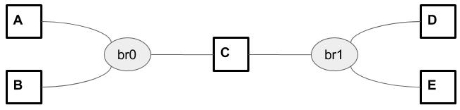

Exemple de réseau Docker :
==========================

**Script** : le script _TutorielDoubleBridgeDocker.sh_ correspond et permet de lancer cet example.

Détails de la configuration souhaitée :
---------------------------------------

**Sous réseau br0 :** 192.168.1.0/24

|Stations   |A           |B           |C           |
|-----------|------------|------------|------------|
|Adresses IP|192.168.1.10|192.168.1.20|192.168.1.30|

**Sous réseau br1 :** 192.168.2.0/24

|Station   |C           |D           |E           |
|----------|------------|------------|------------|
|Adresse IP|192.168.2.10|192.168.2.20|192.168.2.30|

Création des bridges :
----------------------

		$ docker network create -d bridge --subnet 192.168.1.0/24 br0
		$ docker network create -d bridge --subnet 192.168.2.0/24 br1

Ces réseaux pour docker sont en fait des bridges. On peut les observer avec `brctl` ou `bridge` :

		$ brctl show
		bridge name		bridge id		STP enabled	interfaces
		br-48ed238142f0		8000.02426b4a0c5a	no		veth315a5d9
										vethb45bdb7
										vethe9e8281
		br-4c8d1d3ab5cf		8000.024246a2fbb5	no		vetha16ecfe
										vethdbd76cb
										vethf2c06fe
		docker0			8000.0242f46784a9	no

**Remarque :** `docker0` est le bridge par défault de Docker.

Créations des hosts :
---------------------

		$ docker create -it --name stationA --hostname stationA --net br0 --cap-add NET_ADMIN alpine:latest /bin/sh
		$ docker create -it --name stationB --hostname stationB --net br0 --cap-add NET_ADMIN alpine:latest /bin/sh
		$ docker create -it --name stationC --hostname stationC --net br0 --cap-add NET_ADMIN alpine:latest /bin/sh
		$ docker create -it --name stationD --hostname stationD --net br1 --cap-add NET_ADMIN alpine:latest /bin/sh
		$ docker create -it --name stationE --hostname stationE --net br1 --cap-add NET_ADMIN alpine:latest /bin/sh

L'option --cap-add NET_ADMIN permet à la station de pouvoir modifier ses propres interfaces.

Boot des hosts :
----------------

		$ docker start stationA
		$ docker start stationB
		...

Le cas de la station C :
------------------------

La stationC appartient déjà au réseau 192.168.1.0/24 mais pas à 192.168.2.0/24 :

		$ docker network connect stationC br1

Mettre en place les adresses ip :
---------------------------------

		$ docker exec stationA ip addr add 192.168.1.10/24 dev eth0
		$ docker exec stationB ip addr add 192.168.1.20/24 dev eth0
		$ docker exec stationC ip addr add 192.168.1.30/24 dev eth0
		$ docker exec stationC ip addr add 192.168.2.10/24 dev eth1
		...

Activez le routage de C :
-------------------------

		$ docker exec stationC echo 1 > /proc/sys/net/ipv4/ip_forward

Mettre en place les tables de routage des stations :
--------------------------------------------------

* Stations d'extrémitées X du sous réseau 192.168.1.0/24 :

		$ docker exec stationX ip route add 192.168.2.0/24 via 192.168.1.30

* Stations d'extrémitées X du sous réseau 192.168.2.0/24 :

		$ docker exec stationX ip route add 192.168.1.0/24 via 192.168.2.10
