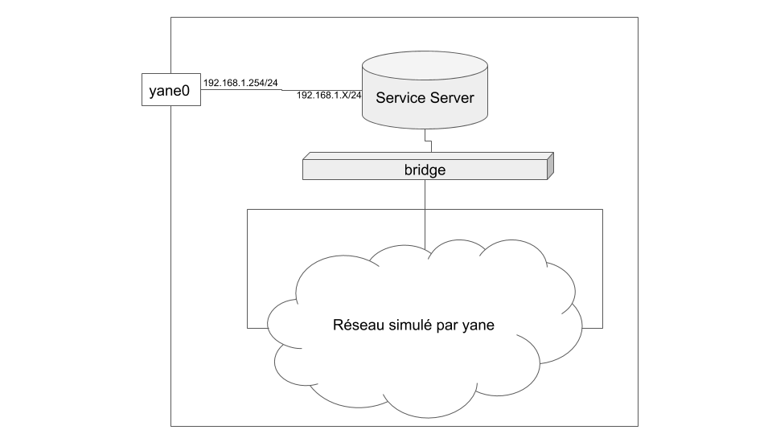

# Les services
## Yane est modulaire, les services aussi.

Avant tout je vous invite à lire le tutoriel programeur pour yane [ici](./TutorielProgrammeur.md).

Un service dans yane est un module qui implémente certaines fonctions définie dans [yane_module_services](../yane_module_services).
Du point de vue du réseau yane **il doit être considérer comme un hôte**. Cependant contrairement à un hôte il est directement connecté à la machine hôte via une interface (int0:192.168.1.1) virtuelle.

## Rappel

La mise en place d'un host suit 2 étapes :
* Sa création : `yaneCreateHost_`
* Sa mise en service (boot) : `yaneBootHost_`

Étant donnée que le service est un host, un peu spécial certes, il doit lui aussi suivre ces étapes. Pas de panique cependant yane peut s'en occuper seul. En effet vous pouvez réutiliser les fonctions des modules déjà présent pour créer l'host.

## Comprendre par l'exemple

Imaginons que vous vouliez développer un nouveau module de service destinée à fournir une source de trafic pour votre réseau yane. Vous choisissez comme source de trafic un système Ubuntu qui envoie des e-mails à un débit que vous avez spécifié dans un fichier de configuration. Pour créer votre nouveau module vous aller devoir suivre plusieurs étapes :

### 1. Choisir un `mode` de virtualisation :
  * **docker** (à privilégier pour les services) :

    Vous devrez fournir une image Docker avec le client mail de votre choix, plus tous les logiciels que vous pourriez avoir besoin.
    Une fois l'image construite stable vous pouvez la placer dans le répertoire [`YANE_ROOT_DIR/images`](../images).  
  * netns

    Probablement pas le plus simple car votre service sera directement lancé dans votre machine (partage une partie des mêmes fichiers) ce qui rend l'exercice potentiellement dangereux pour celle-ci.
  * ...

  Pour la suite on va supposer que vous avez choisi Docker.

### 2. Rédaction du nouveau module

  Le nouveau module doit être nommé de cette manière : `yane_module_<MODULE_NAME>` et placé dans le répertoire [`YANE_ROOT_DIR`](../). Ce qui pourrait donné dans notre exemple `yane_module_postfix` (à vous de trouver un nom explicite). Le nom du module doit correspondre au champ type dans le fichier `yane.yml` :
  ```Yaml
  services:
    name: postfixServer
    type: postfix
    ...
  ```
  Une fois le fichier créé celui-ci doit fournir 4 fonctions. Celles-ci seront automatiquement appelé par yane via le module [yane_module_services](../yane_module_services).

  Les 4 fonctions sont :

  * `yaneCreateService_<TYPE>`

  Cette fonction doit créer le service à la manière d'un host. En effet cette fonction doit créer un service en utilisant les fonctions `yaneCreateHost_<MODE>`. Ce qui donnera dans notre exemple `yaneCreateHost_docker`.

  Créer un service à la manière d'un hôte va permettre la **création automatique des liens** entre votre réseau et le service par yane, mais aussi de boot automatiquement le service. Un autre objectif de cette fonction est de **charger les fichiers de configuration** fourni par l'utilisateur dans le service.

  **Important :**
  Pour que yane considère votre service comme un host de son réseau vous devez en plus de le créer via une fonction `yaneCreateHost_<TYPE>`, compléter les variables `hostName`, `hostMode` et `hostImage` pour que yane boot votre service (voir le module [yane_module_dnsmasq](../yane_module_dnsmasq)). Ici :
  ```Bash
  hostName[$serviceName]=$serviceName
  hostMode[$serviceName]="docker"
  hostImage[$serviceName]="postfix"
  ```

  * `yaneShutdownService_<TYPE>`

  Cette fonction sera appelé lors de l'arrêt de la session en cours.
  Dans cette fonction vous devrez faire appel aux fonctions `yaneShutdownHost_<MODE>`. Dans notre exemple : `yaneShutdownHost_docker`.
  Vous pouvez également stopper tous les processus lancé par/pour votre service.

  * `yaneDeleteService_<TYPE>`

  Cette fonction sera appelé lors de l'arrêt de la session en cours. Elle doit permettre de supprimer toutes les ressources lancées par votre service. Elle doit donc faire appel aux fonctions `yaneDeleteHost_<MODE>`. Dans notre exemple on fera seulement appel à `yaneDeleteHost_docker`.

  * `yaneRunService_<TYPE>`

  Cette dernière fonction est appelé juste après le boot des hosts donc de votre service. Elle peut donc vous servir à lancer certaines applications sur votre services ou bien à le configurer. Elle est donc à compléter selon vos besoin. Dans le cas de dnsmasq par exemple c'est dans cette fonction que le module relie la machine hôte et le service puis modifie le NAT du service pour donner accès à internet au réseau yane.

## Structure des services dans yane0

Pour illustrer la structure des services dans yane rien de mieux qu'un schéma :

