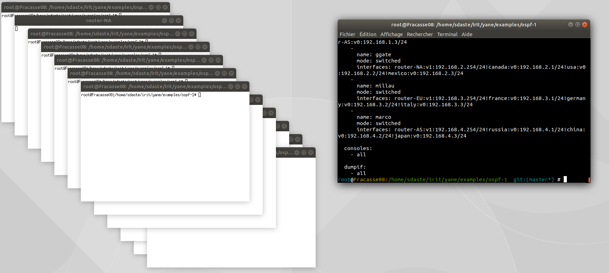

# Les Terminaux

Certaines de vos simulations peuvent atteindre plusieurs dizaines de machines. Par conséquent ouvrir 30 xterm différents peut être très fatiguant. Yane vous offre plusieurs possibilités pour afficher vos machines grâce à la syntaxe du fichier yane.yml.

## Syntaxe

Dans le fichier `yane.yml` vous pouvez décrire la vue que vous désirez de façon précise pour chaque hôte grace à la balise `consoles` :
```yaml
consoles:
  - all
```
Cette syntaxe permet d'obtenir un terminal pour chaque machine.
```Yaml
consoles:
  -
    host: __HOST-NAME__
    mode: xterm
```
Grâce au mode `xterm` vous pouvez choisir d'afficher qu'un nombre limité de terminaux.
```Yaml
consoles:
  -
    host: __HOST-NAME__
    mode: tmux
    session: __NAME__

```
Avec le mode `tmux` vous pouvez choisir de regrouper certain terminaux en session.

## host
Cette balise doit être suivi du nom d'un hôte décrit sous la balise `hosts`. Si ce nom ne correspond aucun hôte votre terminal ne s'affichera pas.

## mode
Cette balise doit être suivi du nom d'un mode de console. Voici une liste exhaustive :
```
tmux
xterm
```
Vous pouvez rajouter des modes de consoles pour cela voir la [doc programmeur](ManuelProgrammmaurTerminaux.md) sur les consoles.

## session
Cette balise n'est pertinente que pour les consoles de type `tmux`. En effet `tmux` utilise la notion de session pour regrouper différent panneaux. Vous pouvez grâce à cette balise définir des groupes de terminaux. Et ainsi trier vos terminaux pour un meilleur lisibilité.

**Par exemple :** vous pouvez réunir sous une même session `tmux` toutes les consoles des routeurs de votre réseau et sur une autre session toutes les machines d'extrémités. Pour cela il vous suffit de donner le même nom de session aux hôtes concernés.

## -all
Pour obtenir rapidement un terminal pour chaque machine vous pouvez utiliser le flag `all`. Par défaut yane va ouvrir une console `xterm` pour chaque hôte :



## Exemples

* 2 sessions tmux : `routers` et `users` :
```Yaml
consoles:
  -
    host: r1
    mode: tmux
    session: routers
  -
    host: r2
    mode: tmux
    session: routers
  -
    host: a
    mode: tmux
    session: users
  -
    host: b
    mode: tmux
    session: users
```

* vous pouvez mixer `xterm` et `tmux` :
```Yaml
consoles:
  -
    host: r1
    mode: xterm
  -
    host: r2
    mode: xterm
  -
    host: a
    mode: tmux
  -
    host: b
    mode: tmux
    session: users
```

* Un bon exemple de l'utilisation du mode tmux est l'exemple ospf-1.

## Pour aller plus loin

Il existe actuellement 2 modes de consoles : `tmux` et `xterm`. Vous pouvez obtenir plus d'aide sur le fonctionnement de ces programmes : [tmux](https://tmux.github.io), [xterm](https://wiki.archlinux.org/index.php/Xterm).

Si vous voulez ajouter d'autre mode de console je vous invite à regarder le [manuel console programmeur](ManuelProgrammmaurTerminaux.md).
