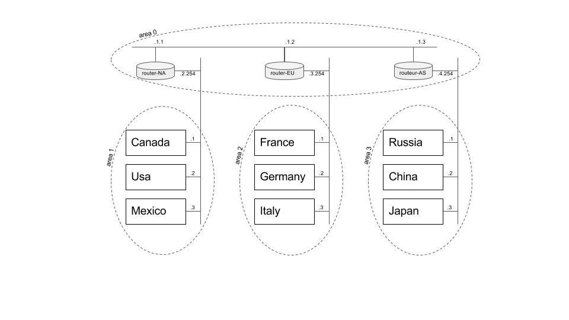

ospf-1
======

Cet exemple représente le réseau suivant :


Les 3 routeurs `router-NA`, `router-EU`, `router-AS` sont des routeurs OSPF. En effet ils possèdent la suite `quagga`.

Pour lancer OSPF il va falloir le faire manuellement de la façon suivante pour chaque routeur :

```
# telnet localhost ospfd
password : zebra
ospf$ enable
ospf# configure terminal
ospf(config)# router ospf
```
On peut maintenant configurer le routeur. Chaque routeur OSPF à besoin d'un ID. Celui-ci peut être arbitraire mais on peut aussi choisir son adresse IP. Ensuite il faut ajouter chaque sous-réseau de notre réseau. Dans notre exemple chaque routeur appartient au réseau `192.168.1.0/24`. Celui-ci correspond à la `backbone area` de OSPF, il va donc falloir ajouter ce réseau à l'`area 0` de chaque routeur. Enfin on ajoute le deuxième sous-réseau `x` auquel appartient chaque routeur.

```
ospf(config-router)# router-id <ID>
ospf(config-router)# network 192.168.1.0/24 area 0
ospf(config-router)# network 192.168.x.0/24 area x
```

**Attention :** Vous devrez toujours mettre en place les routes par défaut des machines d'extrémités.
